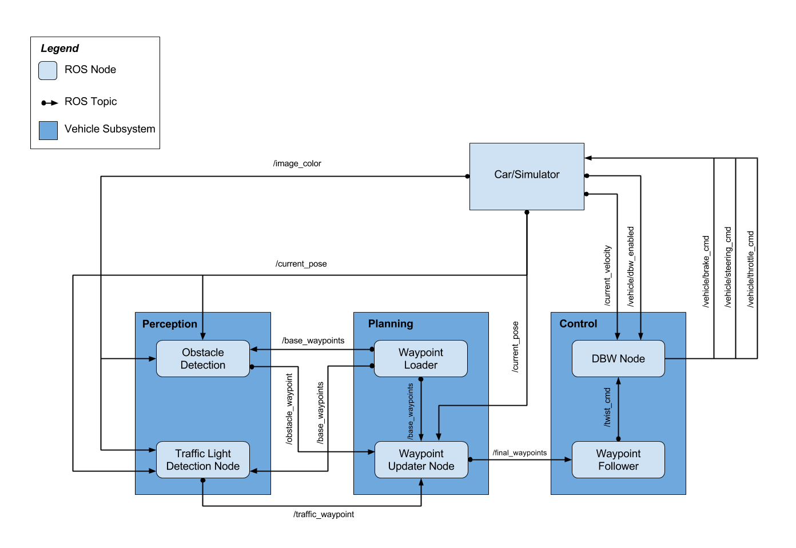

Capstone Project - System Integration
=====================================
The goal of this project is to enable Carla, Udacity\`s autonomous car, to drive
around a test track using waypoint navigation. The car must stop at traffic lights without human intervention.
The project is developed using ROS and it is tested with a simulator and also video images recorded from Carla in a test track.

Team
----

**Team name** : Team 0

| **Name**                          | **e-mail**                |
|-----------------------------------|---------------------------|
| Guilherme Schlinker (team lead)   | guilhermess\@gmail.com    |
| Zhao Lang                         | eltoshan\@gmail.com       |
| Oisin Dolphin                     | dolphino\@tcd.ie          |
| Jin Kurumisawa                    | kurumi722\@gmail.com      |
| Fabio Takemura                    | fabio.takemura\@gmail.com |

System Architecture
--------
The system architecture is composed of three main modules: perception, planning and control. The Figure below 
shows how those modules interact with each other and with the simulator. Udacity provided the base implementation of the
project and our team developed the remaining features so that the car could follow waypoints, detect and stop at traffic
lights. Each module in the project is implemented using ROS nodes.
* **Perception**: this module is responsible for detecting traffic lights and obstacles. **Team contribution**: implement traffic
 light detection and classification node.

* **Planning**:  this module (i) loads the waypoints the car should follow (Waypoint Loader) and 
(ii) publishes the next waypoints given the car current position and traffic light information (Waypoint Updater), adjusting
the velocity accordingly based on traffic light states ahead of the vehicle.  **Team contribution**: implement the Waypoint 
Updater node, publishing the final waypoints with velocity adjusted based  on traffic light information.

* **Control**: this module publishes the controls of the car (steer, throttle and brake) based on target angular and
linear speed and current car velocity. **Team contribution**: implement DBW Node with two PID controllers 
for (i) throttle/break and for (ii) steering.

### Perception
The team contribution to the perception module is to implement traffic light detection and classification. 
The solution is implemented in the node ros/src/tl_detector/ in tl_detector.py and light_classification/tl_classifier.py.
The following messages are used in the traffic light detection ROS node:
* **/image_color**: input camera image from the simulator or the car. The image is used to classify the traffic light.
* **/vehicle/traffic_lights**: input location of the position of traffic lights.
* **/traffic_waypoint**: output message with the waypoint number of an upcoming red light, otherwise it publishes -1.

The following steps describe the solution implemented to detect and classify traffic
lights:
1.  Receive the car camera image, traffic light and car location messages.
2.  Select the nearest traffic lights which is ahead of the car. 
    In this step the car location is used to verify if the traffic is ahead
    of the car and the distance to the traffic light. Validate if the traffic
    lights distance is within a certain range, otherwise the traffic light is
    ignored.
3.  Classify the light color of the traffic light. The classification uses the 
    Faster R-CNN with Resnet-101 architecture from the [Tensorflow Object Detection
    API](https://github.com/tensorflow/models/tree/master/research/object_detection).

    Due to the small quantity of training data available, we leveraged double
    transfer learning. Starting with the weights pre-trained on the COCO
    dataset, the first pass of the model was fine-tuned on the [Bosch Small
    Traffic Lights Dataset](https://hci.iwr.uni-heidelberg.de/node/6132). We
    then trained two separate detectors in the second stage, one for the
    simulator and one for the test site.

4.  Publish red traffic light waypoint. Depending on the distance of the car to the traffic light we also
publish the waypoint of yellow lights as the light will likely be red when the car reaches the traffic light.
Green lights are not published as the car does not need to stop. In that case we publish -1 in /traffic_waypoint.

The images below show traffic light classification results in the simulator and in real-world camera images. 
It is important to mention that in some real-world frames yellow lights were detected as red. This is not critical as 
 the solution implemented slows down the car when there is a yellow light ahead.

* Simulator red light detected:

* Simulator yellow light detected:

* Simulator green light detected:

* Site red light detected:

* Site yellow light, detected red:

* Site green light detected:

### Planning
The planning module is implemented in two ROS nodes:
1. Waypoint Loader: loads the waypoint information and publishes using the message **/base_waypoints**. This node is
provided by Udacity.
2. Waypoint Updater: receives the car location from **/current_pose**, **/current_velocity**, 
**/base_waypoints** and **/traffic_waypoint**, publishing updated waypoint information to **/final_waypoints**. Our team
implemented the Waypoint Updater node.
 
The following steps describe the implementation of the Waypoint Updater node:

1.  Receive the base waypoints, car location, car velocity and traffic light waypoints.

2.  If there is a red traffic light published in /traffic_waypoint, the target car velocity is gradually set to 0
     based on the distance from the car to the traffic light.

3.  Publish the updated waypoints with adjusted velocity to /final_waypoints.

### Control
The control module is responsible to read the control target input and send
vehicle actuation commands to navigate the vehicle.

The DBW Node subscribe "/twist_cmd" which includes target linear velocity and
target angular velocity published by Waypoint Follower Node. Waypoint Follower
Node calculates and publishes target linear velocity and target angular velocity
based on the "/final_waypoints" published by Waypoint Updater Node.
"/final_waypoints" is a list of waypoints ahead with target velocity from
Waypoint Updater Node. Target speed is adjusted if the perception module
detected red traffic light ahead.

The following steps are the main steps implemented on planning components:

1.  Read current car velocity, car location, target vehicle linear and angular
    velocities and indication if the car is under dbw or driver control.

2.  Calculate the throttle, brake and steer values. The throttle and brake PID output ranges from -1 to 1, with a gap
 in the ranges between -0.1 and 0.1 where no throttle or brake is applied. If the output is less than -0.1 it is considered 
 as brake and if it is greater than 0.1 it is considered as throttle. 
 The output values are  adjusted for the expected ranges of the car, namely [0, 1] for throttle, [0, 3250] for brake and
   [-8.2, 8.2] for steering. The solution implemented also uses low pass filters so that the result is a smooth drive.
 The following parameters are used for the PID controllers. Those were defined empirically, using the simulator to verify
 the results:

| **Control**      | **Kp** | **Ki** | **Kd** |
|------------------|--------|--------|--------|
| throttle, brake  | 2      | 0      | 0.5    |
| steer            | 0.5    | 0      | 1      |

### Conclusion
This project shows the implementation of a self-driving car solution that works in the in Udacity's autonomous car Carla. 
It uses ROS as the base system, neural networks for traffic light classification and PID controllers for steering 
and throttle/brake. The solution was successfully tested using Udacity's simulator and it will also be uploaded and 
tested in Carla.
 

### Appendix: Getting Started

In order to run the project, the following prerequisites must be fulfilled and
software installed.

-   Be sure that your workstation is running Ubuntu 16.04 Xenial Xerus or Ubuntu
    14.04 Trusty Tahir. [Ubuntu downloads can be found
    here](https://www.ubuntu.com/download/desktop).

-   If using a Virtual Machine to install Ubuntu, use the following
    configuration as minimum:

-   2 CPU

-   2 GB system memory

-   25 GB of free hard drive space

The Udacity provided virtual machine has ROS and Dataspeed DBW already
installed, so you can skip the next two steps if you are using this.

-   Follow these instructions to install ROS

-   [ROS Kinetic](http://wiki.ros.org/kinetic/Installation/Ubuntu) if you have
    Ubuntu 16.04.

-   [ROS Indigo](http://wiki.ros.org/indigo/Installation/Ubuntu) if you have
    Ubuntu 14.04.

-   [Dataspeed DBW](https://bitbucket.org/DataspeedInc/dbw_mkz_ros)

-   Use this option to install the SDK on a workstation that already has ROS
    installed: [One Line SDK Install
    (binary)](https://bitbucket.org/DataspeedInc/dbw_mkz_ros/src/81e63fcc335d7b64139d7482017d6a97b405e250/ROS_SETUP.md?fileviewer=file-view-default)

-   Download the [Udacity
    Simulator](https://github.com/udacity/CarND-Capstone/releases/tag/v1.2).

 

#### Docker Installation

[Install Docker](https://docs.docker.com/engine/installation/)

Build the docker container

~~~~~~~~~~~~~~~~~~~~~~~~~~~~~~~~~~~~~~~~~~~~~~~~~~~~~~~~~~~~~~~~~~~~~~~~~~~~~~~~
docker build . -t capstone
~~~~~~~~~~~~~~~~~~~~~~~~~~~~~~~~~~~~~~~~~~~~~~~~~~~~~~~~~~~~~~~~~~~~~~~~~~~~~~~~

Run the docker file

~~~~~~~~~~~~~~~~~~~~~~~~~~~~~~~~~~~~~~~~~~~~~~~~~~~~~~~~~~~~~~~~~~~~~~~~~~~~~~~~
docker run -p 127.0.0.1:4567:4567 -v $PWD:/capstone -v /tmp/log:/root/.ros/ --rm -it capstone
~~~~~~~~~~~~~~~~~~~~~~~~~~~~~~~~~~~~~~~~~~~~~~~~~~~~~~~~~~~~~~~~~~~~~~~~~~~~~~~~
 

#### Usage

1.  Clone the project repository

    ~~~~~~~~~~~~~~~~~~~~~~~~~~~~~~~~~~~~~~~~~~~~~~~~~~~~~~~~~~~~~~~~~~~~~~~~~~~~
    git clone https://github.com/guilhermess/CarND-Capstone
    ~~~~~~~~~~~~~~~~~~~~~~~~~~~~~~~~~~~~~~~~~~~~~~~~~~~~~~~~~~~~~~~~~~~~~~~~~~~~

2.  Install python dependencies

    ~~~~~~~~~~~~~~~~~~~~~~~~~~~~~~~~~~~~~~~~~~~~~~~~~~~~~~~~~~~~~~~~~~~~~~~~~~~~
    cd CarND-Capstone
    pip install -r requirements.txt
    ~~~~~~~~~~~~~~~~~~~~~~~~~~~~~~~~~~~~~~~~~~~~~~~~~~~~~~~~~~~~~~~~~~~~~~~~~~~~

3.  Make and run styx

    ~~~~~~~~~~~~~~~~~~~~~~~~~~~~~~~~~~~~~~~~~~~~~~~~~~~~~~~~~~~~~~~~~~~~~~~~~~~~
    cd ros
    catkin_make
    source devel/setup.sh
    roslaunch launch/styx.launch
    ~~~~~~~~~~~~~~~~~~~~~~~~~~~~~~~~~~~~~~~~~~~~~~~~~~~~~~~~~~~~~~~~~~~~~~~~~~~~

4.  Run the simulator
 

#### Real world testing

1.  Download [training
    bag](https://drive.google.com/file/d/0B2_h37bMVw3iYkdJTlRSUlJIamM/view?usp=sharing)
    that was recorded on the Udacity self-driving car (a bag demonstraing the
    correct predictions in autonomous mode can be found
    [here](https://drive.google.com/open?id=0B2_h37bMVw3iT0ZEdlF4N01QbHc))

2.  Unzip the file

    ~~~~~~~~~~~~~~~~~~~~~~~~~~~~~~~~~~~~~~~~~~~~~~~~~~~~~~~~~~~~~~~~~~~~~~~~~~~~
    unzip traffic_light_bag_files.zip
    ~~~~~~~~~~~~~~~~~~~~~~~~~~~~~~~~~~~~~~~~~~~~~~~~~~~~~~~~~~~~~~~~~~~~~~~~~~~~

3.  Play the bag file

    ~~~~~~~~~~~~~~~~~~~~~~~~~~~~~~~~~~~~~~~~~~~~~~~~~~~~~~~~~~~~~~~~~~~~~~~~~~~~
    rosbag play -l traffic_light_bag_files/loop_with_traffic_light.bag
    ~~~~~~~~~~~~~~~~~~~~~~~~~~~~~~~~~~~~~~~~~~~~~~~~~~~~~~~~~~~~~~~~~~~~~~~~~~~~

4.  Launch your project in site mode

    ~~~~~~~~~~~~~~~~~~~~~~~~~~~~~~~~~~~~~~~~~~~~~~~~~~~~~~~~~~~~~~~~~~~~~~~~~~~~
    cd CarND-Capstone/ros
    roslaunch launch/site.launch
    ~~~~~~~~~~~~~~~~~~~~~~~~~~~~~~~~~~~~~~~~~~~~~~~~~~~~~~~~~~~~~~~~~~~~~~~~~~~~

5.  Confirm that traffic light detection works on real life images

