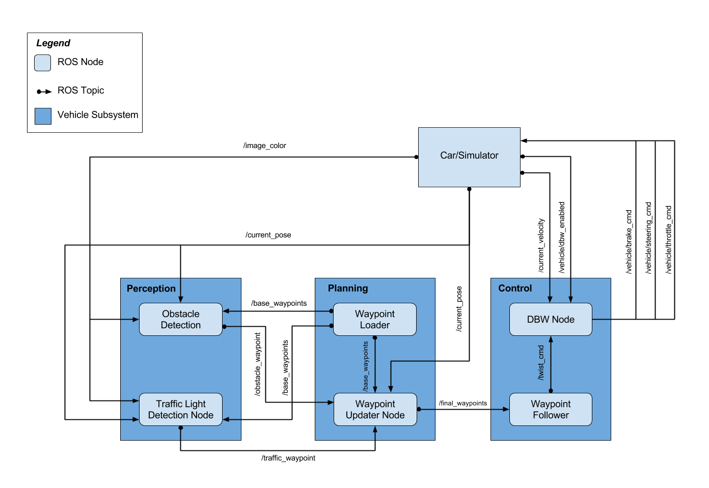
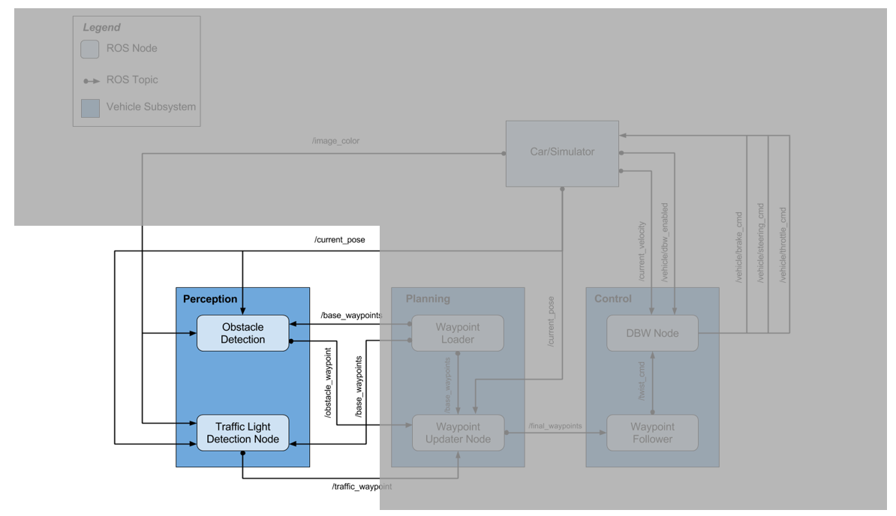
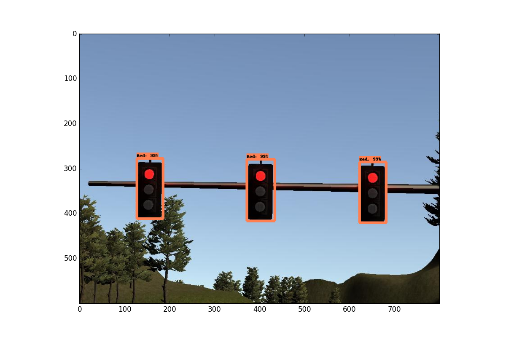
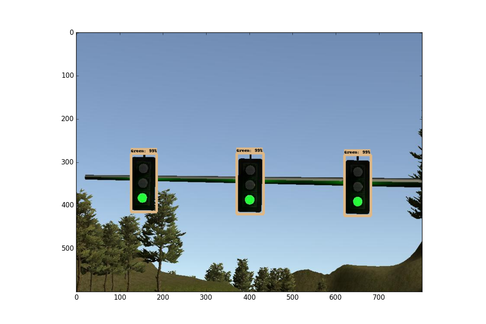
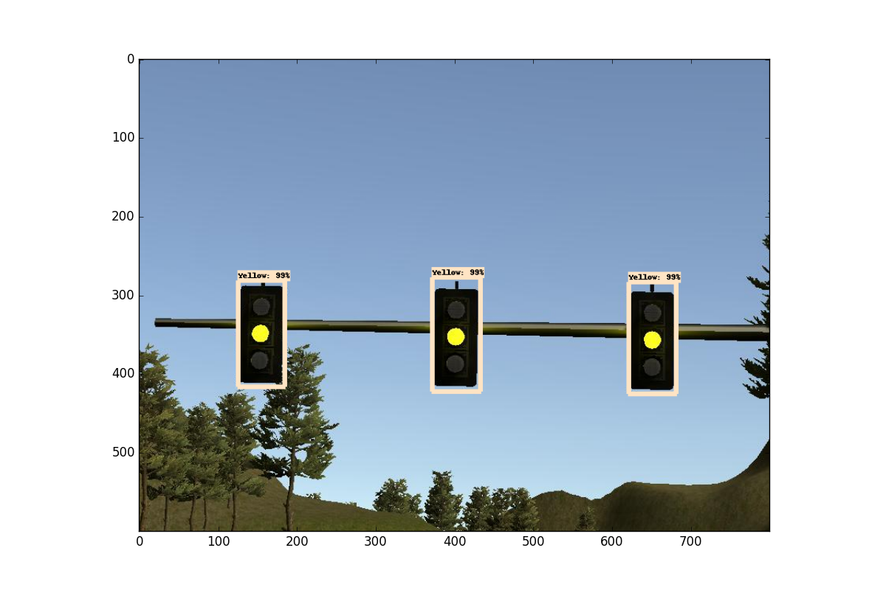
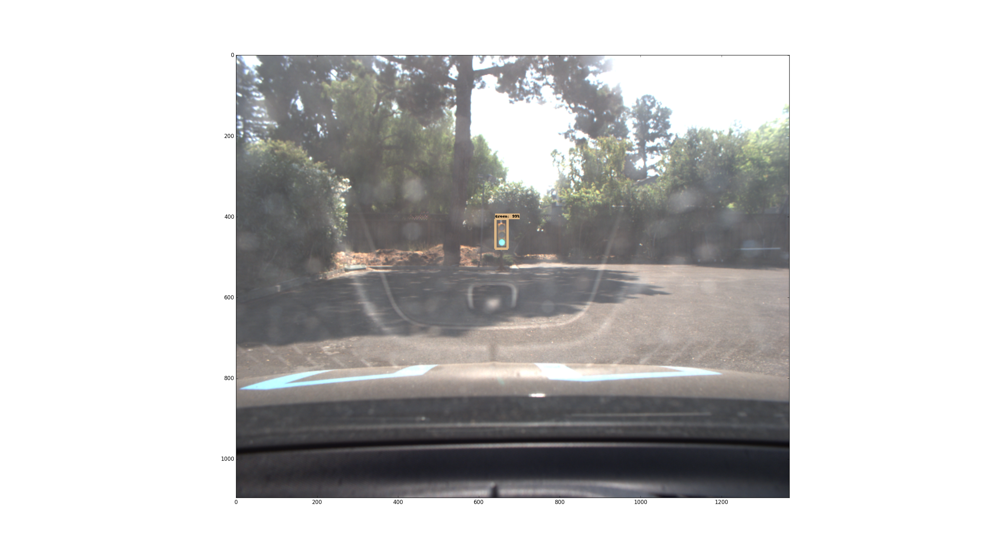
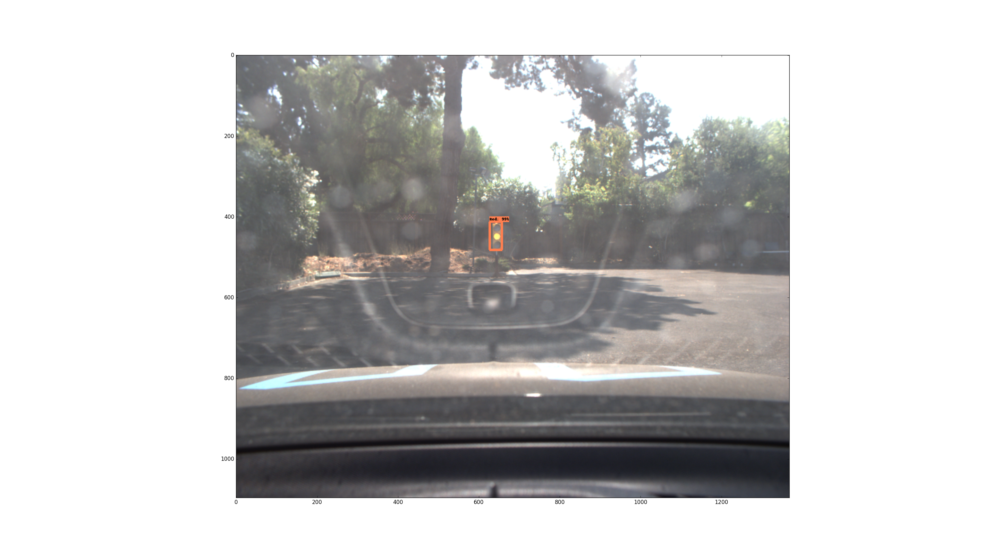
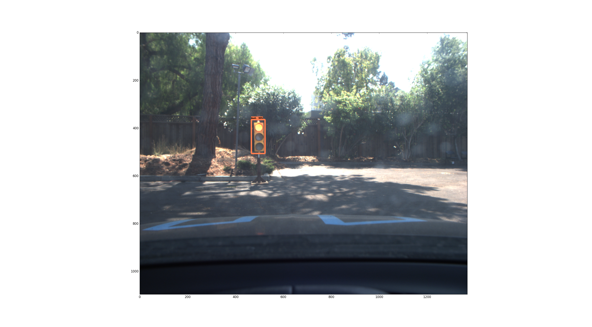
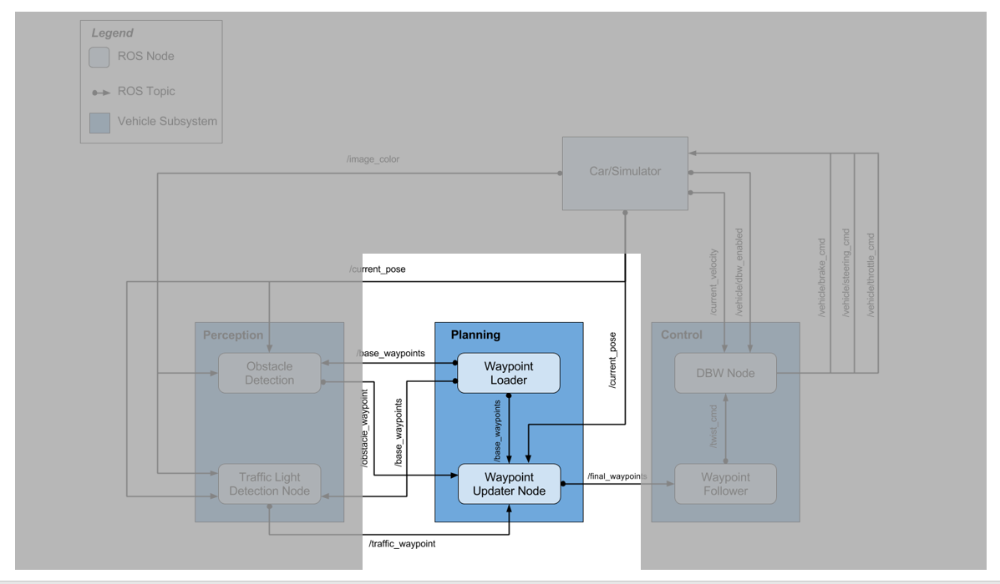
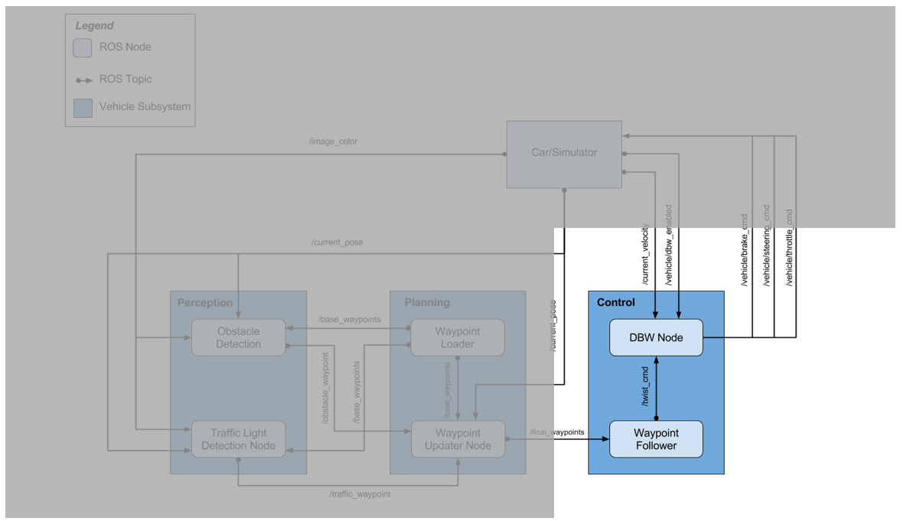

Capstone Project - System Integration
=====================================

The goal of this project is enable Carla, Udacity\`s autonomous car, to drive
around a test track using waypoint navigation. The car most avoid obstacles and
stop at traffic lights without human intervention.

 

Getting Started
---------------

In order to run the project, the following prerequisites must be fulfilled and
software installed.

 

-   Be sure that your workstation is running Ubuntu 16.04 Xenial Xerus or Ubuntu
    14.04 Trusty Tahir. [Ubuntu downloads can be found
    here](https://www.ubuntu.com/download/desktop).

-   If using a Virtual Machine to install Ubuntu, use the following
    configuration as minimum:

-   2 CPU

-   2 GB system memory

-   25 GB of free hard drive space

The Udacity provided virtual machine has ROS and Dataspeed DBW already
installed, so you can skip the next two steps if you are using this.

-   Follow these instructions to install ROS

-   [ROS Kinetic](http://wiki.ros.org/kinetic/Installation/Ubuntu) if you have
    Ubuntu 16.04.

-   [ROS Indigo](http://wiki.ros.org/indigo/Installation/Ubuntu) if you have
    Ubuntu 14.04.

-   [Dataspeed DBW](https://bitbucket.org/DataspeedInc/dbw_mkz_ros)

-   Use this option to install the SDK on a workstation that already has ROS
    installed: [One Line SDK Install
    (binary)](https://bitbucket.org/DataspeedInc/dbw_mkz_ros/src/81e63fcc335d7b64139d7482017d6a97b405e250/ROS_SETUP.md?fileviewer=file-view-default)

-   Download the [Udacity
    Simulator](https://github.com/udacity/CarND-Capstone/releases/tag/v1.2).

 

### Docker Installation

[Install Docker](https://docs.docker.com/engine/installation/)

Build the docker container

~~~~~~~~~~~~~~~~~~~~~~~~~~~~~~~~~~~~~~~~~~~~~~~~~~~~~~~~~~~~~~~~~~~~~~~~~~~~~~~~
docker build . -t capstone
~~~~~~~~~~~~~~~~~~~~~~~~~~~~~~~~~~~~~~~~~~~~~~~~~~~~~~~~~~~~~~~~~~~~~~~~~~~~~~~~

Run the docker file

~~~~~~~~~~~~~~~~~~~~~~~~~~~~~~~~~~~~~~~~~~~~~~~~~~~~~~~~~~~~~~~~~~~~~~~~~~~~~~~~
docker run -p 127.0.0.1:4567:4567 -v $PWD:/capstone -v /tmp/log:/root/.ros/ --rm -it capstone
~~~~~~~~~~~~~~~~~~~~~~~~~~~~~~~~~~~~~~~~~~~~~~~~~~~~~~~~~~~~~~~~~~~~~~~~~~~~~~~~

 

### Usage

1.  Clone the project repository

    ~~~~~~~~~~~~~~~~~~~~~~~~~~~~~~~~~~~~~~~~~~~~~~~~~~~~~~~~~~~~~~~~~~~~~~~~~~~~
    git clone https://github.com/guilhermess/CarND-Capstone
    ~~~~~~~~~~~~~~~~~~~~~~~~~~~~~~~~~~~~~~~~~~~~~~~~~~~~~~~~~~~~~~~~~~~~~~~~~~~~

2.  Install python dependencies

    ~~~~~~~~~~~~~~~~~~~~~~~~~~~~~~~~~~~~~~~~~~~~~~~~~~~~~~~~~~~~~~~~~~~~~~~~~~~~
    cd CarND-Capstone
    pip install -r requirements.txt
    ~~~~~~~~~~~~~~~~~~~~~~~~~~~~~~~~~~~~~~~~~~~~~~~~~~~~~~~~~~~~~~~~~~~~~~~~~~~~

3.  Make and run styx

    ~~~~~~~~~~~~~~~~~~~~~~~~~~~~~~~~~~~~~~~~~~~~~~~~~~~~~~~~~~~~~~~~~~~~~~~~~~~~
    cd ros
    catkin_make
    source devel/setup.sh
    roslaunch launch/styx.launch
    ~~~~~~~~~~~~~~~~~~~~~~~~~~~~~~~~~~~~~~~~~~~~~~~~~~~~~~~~~~~~~~~~~~~~~~~~~~~~

4.  Run the simulator

 

### Real world testing

1.  Download [training
    bag](https://drive.google.com/file/d/0B2_h37bMVw3iYkdJTlRSUlJIamM/view?usp=sharing)
    that was recorded on the Udacity self-driving car (a bag demonstraing the
    correct predictions in autonomous mode can be found
    [here](https://drive.google.com/open?id=0B2_h37bMVw3iT0ZEdlF4N01QbHc))

2.  Unzip the file

    ~~~~~~~~~~~~~~~~~~~~~~~~~~~~~~~~~~~~~~~~~~~~~~~~~~~~~~~~~~~~~~~~~~~~~~~~~~~~
    unzip traffic_light_bag_files.zip
    ~~~~~~~~~~~~~~~~~~~~~~~~~~~~~~~~~~~~~~~~~~~~~~~~~~~~~~~~~~~~~~~~~~~~~~~~~~~~

3.  Play the bag file

    ~~~~~~~~~~~~~~~~~~~~~~~~~~~~~~~~~~~~~~~~~~~~~~~~~~~~~~~~~~~~~~~~~~~~~~~~~~~~
    rosbag play -l traffic_light_bag_files/loop_with_traffic_light.bag
    ~~~~~~~~~~~~~~~~~~~~~~~~~~~~~~~~~~~~~~~~~~~~~~~~~~~~~~~~~~~~~~~~~~~~~~~~~~~~

4.  Launch your project in site mode

    ~~~~~~~~~~~~~~~~~~~~~~~~~~~~~~~~~~~~~~~~~~~~~~~~~~~~~~~~~~~~~~~~~~~~~~~~~~~~
    cd CarND-Capstone/ros
    roslaunch launch/site.launch
    ~~~~~~~~~~~~~~~~~~~~~~~~~~~~~~~~~~~~~~~~~~~~~~~~~~~~~~~~~~~~~~~~~~~~~~~~~~~~

5.  Confirm that traffic light detection works on real life images

 

Solution
--------

The project is composed of three main components which are responsible to detect
and classify traffic lights, detect obstacles, define the car speed, define way
points and control the car. The functions described in this document do not
represent all necessary functions to run the solution, but only the functions
created or modified by the team.

 
-

 

### Perception

The perception component detect traffics lights and classify the detected
traffic light. In additional the perception component detects obstacles. The
following steps are the main steps implemented to detect and classify traffic
lights:

1.  Read the input image: car camera image, traffic lights locations, car
    location

2.  Transform traffic lights waypoints to to the vehicle's coordinate system.

3.  Select the nearest traffic lights which is ahead of the car and the light is
    on. In this step the car location is used to verify if the traffic is ahead
    of the car and the distance to the traffic light. Validate if the traffic
    lights distance is within a certain range, otherwise the traffic light is
    ignored.

4.  Classify the light color of the traffic light. The classification was done
    performed in one model using the Faster R-CNN with Resnet-101 architecture
    from the [Tensorflow Object Detection
    API](https://github.com/tensorflow/models/tree/master/research/object_detection).

    Due to the small quantity of training data available, we leveraged double
    transfer learning. Starting with the weights pre-trained on the COCO
    dataset, the first pass of the model was fine-tuned on the [Bosch Small
    Traffic Lights Dataset](https://hci.iwr.uni-heidelberg.de/node/6132). We
    then trained two separate detectors in the second stage, one for the
    simulator and one for the test site.

5.  Publish red traffic light. The yellow and green traffic lights are relevant
    for the solution because theses columns does not affect the car behavior.

 

**tl_detector.py**

-   *get_closest_waypoint* - This function calculates the distance of each
    waypoint to the given position and return the waypoint closes to the
    position.

    ~~~~~~~~~~~~~~~~~~~~~~~~~~~~~~~~~~~~~~~~~~~~~~~~~~~~~~~~~~~~~~~~~~~~~~~~~~~~
    def get_closest_waypoint(self, pose, dist_threshold=None):
        dl = lambda a, b: (a.x - b.x) ** 2 + (a.y - b.y) ** 2 + (a.z - b.z) ** 2
        min_distance = Nonea
        index = 0
        i = 0
        for wp in self.waypoints.waypoints:
            pos = wp.pose.pose.position
            distance = dl(pos, pose.position)
            if (min_distance == None or distance < min_distance):
                min_distance = distance
                index = i
            i += 1
        if dist_threshold is None or min_distance < dist_threshold:
            return index
        return -1
    ~~~~~~~~~~~~~~~~~~~~~~~~~~~~~~~~~~~~~~~~~~~~~~~~~~~~~~~~~~~~~~~~~~~~~~~~~~~~

 

-   *get_light_state* - Classify the traffic light using the opencv library to
    manipulate the image and the *light_classification.tl_classifier* classify
    the traffic light.

    ~~~~~~~~~~~~~~~~~~~~~~~~~~~~~~~~~~~~~~~~~~~~~~~~~~~~~~~~~~~~~~~~~~~~~~~~~~~~
    def get_light_state(self, light):
        if(not self.has_image):
            self.prev_light_loc = None
            return False

        cv_image = self.bridge.imgmsg_to_cv2(self.camera_image, "bgr8")
        return self.light_classifier.get_classification(cv_image, log_results=True, vis=False), state

        return -1, TrafficLight.UNKNOWN
    ~~~~~~~~~~~~~~~~~~~~~~~~~~~~~~~~~~~~~~~~~~~~~~~~~~~~~~~~~~~~~~~~~~~~~~~~~~~~

 

-   *process_traffic_lights* - Identify the closest traffic light using function
    *get_closest_waypoint* and them classify the traffic light using the
    function *get_light_state.*

    ~~~~~~~~~~~~~~~~~~~~~~~~~~~~~~~~~~~~~~~~~~~~~~~~~~~~~~~~~~~~~~~~~~~~~~~~~~~~
    def process_traffic_lights(self):
        if not self.pose:
            return -1, TrafficLight.UNKNOWN

        light = None
        min_light = None
        stop_line_positions = self.config['stop_line_positions']
        car_waypoint = self.get_closest_waypoint(self.pose.pose)

        min_light_waypoint = -1
        for traffic_light in self.lights:
            light_pos = traffic_light.pose.pose
            light_waypoint = self.get_closest_waypoint(light_pos)
            if light_waypoint != -1 and light_waypoint > car_waypoint and \
                    (min_light_waypoint == -1 or light_waypoint < min_light_waypoint):
                min_light_waypoint = light_waypoint
                min_light = traffic_light

        if min_light_waypoint != -1 and ( min_light_waypoint -  car_waypoint < 250):
            light = self.waypoints.waypoints[min_light_waypoint]

        if light:
            state = self.get_light_state(min_light)
            return min_light_waypoint, state

        return -1, TrafficLight.UNKNOWN
    ~~~~~~~~~~~~~~~~~~~~~~~~~~~~~~~~~~~~~~~~~~~~~~~~~~~~~~~~~~~~~~~~~~~~~~~~~~~~

 

Images below shows traffic light classification results. Mostly the perception
module detected trafficsign and cllassify correctly but classified yellow light
as red light in some frames.

 

 

### Planning

The planning component control the acceleration based on a presence of obstacles
and traffic lights. The following steps are the main steps implemented on
planning components:

 

**waypoint_updater.py**

-   *pose_cb* - Set method for pose attribute*.*

    ~~~~~~~~~~~~~~~~~~~~~~~~~~~~~~~~~~~~~~~~~~~~~~~~~~~~~~~~~~~~~~~~~~~~~~~~~~~~
    def pose_cb(self, msg):
        self.current_pose = msg
    ~~~~~~~~~~~~~~~~~~~~~~~~~~~~~~~~~~~~~~~~~~~~~~~~~~~~~~~~~~~~~~~~~~~~~~~~~~~~

 

-   *waypoints_cb* - Set method for waypoint attribute*.*

    ~~~~~~~~~~~~~~~~~~~~~~~~~~~~~~~~~~~~~~~~~~~~~~~~~~~~~~~~~~~~~~~~~~~~~~~~~~~~
    def waypoints_cb(self, lane):
        self.base_waypoints = lane
    ~~~~~~~~~~~~~~~~~~~~~~~~~~~~~~~~~~~~~~~~~~~~~~~~~~~~~~~~~~~~~~~~~~~~~~~~~~~~

 

-   *traffic_cb* - Set method for traffic waypoint attribute*.*

    ~~~~~~~~~~~~~~~~~~~~~~~~~~~~~~~~~~~~~~~~~~~~~~~~~~~~~~~~~~~~~~~~~~~~~~~~~~~~
    def traffic_cb(self, traffic_waypoint):
        self.traffic_waypoint = traffic_waypoint.data 
    ~~~~~~~~~~~~~~~~~~~~~~~~~~~~~~~~~~~~~~~~~~~~~~~~~~~~~~~~~~~~~~~~~~~~~~~~~~~~

 

### Control

The control component is responsible to read the input and send commands to
navigate the vehicle. This DBW Node subscribe "/twist_cmd" which includes target
linear velocity and target angular velocity published by Waypoint Uploader Node.

 

**dbw_node.py**

-   *\_init\_* - Included the topics subscriptions and created the controller
    object:

    -   /twist_cmd

        -   /current_velocity

        -   /vehicle/dbw_enabled

    ~~~~~~~~~~~~~~~~~~~~~~~~~~~~~~~~~~~~~~~~~~~~~~~~~~~~~~~~~~~~~~~~~~~~~~~~~~~~
    def __init__(self):
        rospy.init_node('dbw_node', log_level=rospy.DEBUG)

        vehicle_mass = rospy.get_param('~vehicle_mass', 1736.35)
        fuel_capacity = rospy.get_param('~fuel_capacity', 13.5)
        brake_deadband = rospy.get_param('~brake_deadband', .1)
        decel_limit = rospy.get_param('~decel_limit', -5)
        accel_limit = rospy.get_param('~accel_limit', 1.)
        wheel_radius = rospy.get_param('~wheel_radius', 0.2413)
        wheel_base = rospy.get_param('~wheel_base', 2.8498)
        steer_ratio = rospy.get_param('~steer_ratio', 14.8)
        max_lat_accel = rospy.get_param('~max_lat_accel', 3.)
        max_steer_angle = rospy.get_param('~max_steer_angle', 8.)

        self.steer_pub = rospy.Publisher('/vehicle/steering_cmd',
                                         SteeringCmd, queue_size=1)
        self.throttle_pub = rospy.Publisher('/vehicle/throttle_cmd',
                                            ThrottleCmd, queue_size=1)
        self.brake_pub = rospy.Publisher('/vehicle/brake_cmd',
                                         BrakeCmd, queue_size=1)
        self.dbw_enabled = False

        self.controller = Controller(wheel_base, steer_ratio, 0, max_lat_accel, max_steer_angle)
        self.twist = None
        self.current_velocity = None
        self.timestamp = None

        rospy.Subscriber('/twist_cmd', TwistStamped, self.twist_cb)
        rospy.Subscriber('/current_velocity', TwistStamped, self.current_velocity_cb)
        rospy.Subscriber('/vehicle/dbw_enabled', Bool, self.dbw_enabled_cb)

        self.loop()
    ~~~~~~~~~~~~~~~~~~~~~~~~~~~~~~~~~~~~~~~~~~~~~~~~~~~~~~~~~~~~~~~~~~~~~~~~~~~~

 

-   *loop* - Get the throttle, brake and steer information from the object
    controller and publish the information when dbw_enabled is on*.* To get the
    vehicle control value, class "Controller" is called and this class is
    defined in "twist_comntroller.py".

    ~~~~~~~~~~~~~~~~~~~~~~~~~~~~~~~~~~~~~~~~~~~~~~~~~~~~~~~~~~~~~~~~~~~~~~~~~~~~
    def loop(self):
        rate = rospy.Rate(10) # 50Hz
        while not rospy.is_shutdown():
            if self.twist is not None and self.current_velocity is not None and self.dbw_enabled:
                current_time = rospy.get_time()
                dt = 1.0/10
                if self.timestamp != None:
                    dt = current_time - self.timestamp
                self.timestamp = current_time

                throttle, brake, steer = self.controller.control(self.twist,
                    self.current_velocity,
                    dt)

                rospy.logdebug('publish steer: %f brake: %f throttle: %f', steer, brake, throttle)
                self.publish(throttle, brake, steer)
            rate.sleep()
    ~~~~~~~~~~~~~~~~~~~~~~~~~~~~~~~~~~~~~~~~~~~~~~~~~~~~~~~~~~~~~~~~~~~~~~~~~~~~

**twist_controller.py**

-   *\_init\_* - Defines parameters for PID controller, YawController and
    LowPassFilter wihch will be used in controller section below. Parameters
    were tuned based on the Simulation result.

~~~~~~~~~~~~~~~~~~~~~~~~~~~~~~~~~~~~~~~~~~~~~~~~~~~~~~~~~~~~~~~~~~~~~~~~~~~~~~~~
    def __init__(self,
                 wheel_base,
                 steer_ratio,
                 min_speed,
                 max_lat_accel,
                 max_steer_angle):
        self._throttle_break_pid = PID(2, 0, 0.5, -1, 1)
        self._steering_pid = PID(0.5, 0, 1.0, -8.2, 8.2)
        self._yaw_controller = YawController(wheel_base,
                                             steer_ratio,
                                             min_speed,
                                             max_lat_accel,
                                             max_steer_angle)

        self._throttle_break_filter = LowPassFilter(0.2, 0.1)
        self._steering_filter = LowPassFilter(0.2, 0.1)
~~~~~~~~~~~~~~~~~~~~~~~~~~~~~~~~~~~~~~~~~~~~~~~~~~~~~~~~~~~~~~~~~~~~~~~~~~~~~~~~

-   *control* - To calculate throttle and brake control value, PID controller
    was used. PID controller calculate and output "throttle_break" to keep
    target linear speed , then this control value was filtered. Depending on the
    control value, either control value was used to calculate "throttle" or
    "brake value".

~~~~~~~~~~~~~~~~~~~~~~~~~~~~~~~~~~~~~~~~~~~~~~~~~~~~~~~~~~~~~~~~~~~~~~~~~~~~~~~~
    def control(self, twist, current_velocity, dt):
        current_speed_ms = current_velocity.twist.linear.x
        target_speed_ms = twist.twist.linear.x
        target_angular_speed = twist.twist.angular.z

        rospy.logdebug("target_speed_ms: %f current_speed_ms: %f target_angular_speed: %f",
                       target_speed_ms, current_speed_ms, target_angular_speed)

        steer = self._yaw_controller.get_steering(target_speed_ms,
                                                  target_angular_speed,
                                                  current_speed_ms)
        steer = self._steering_filter.filt(steer)

        throttle_break = self._throttle_break_pid.step(target_speed_ms - current_speed_ms, dt)
        throttle_break = self._throttle_break_filter.filt(throttle_break)
        throttle = throttle_break * 1 if throttle_break > 0.1 else 0.
        break_value = (-3250.0 * throttle_break) if throttle_break < -0.1 else 0
        return throttle, break_value, steer
~~~~~~~~~~~~~~~~~~~~~~~~~~~~~~~~~~~~~~~~~~~~~~~~~~~~~~~~~~~~~~~~~~~~~~~~~~~~~~~~

Team
----

**Team name : **Team 0

| **Name**                          | **e-mail**                |
|-----------------------------------|---------------------------|
| Guilherme Schlinker (team leader) | guilhermess\@gmail.com    |
| Zhao Lang                         | eltoshan\@gmail.com       |
| Oisin Dolphin                     | dolphino\@tcd.ie          |
| Jin Kurumisawa                    | kurumi722\@gmail.com      |
| Fabio Takemura                    | fabio.takemura\@gmail.com |

 
-
